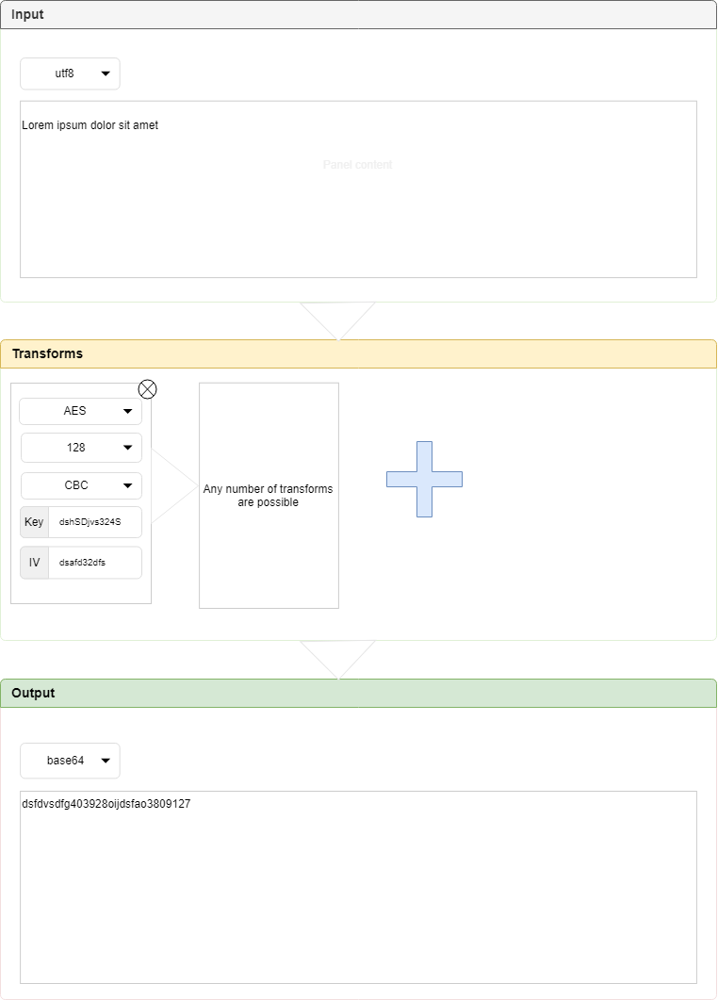

# text-transformer spec

## Layout

## Page Load Spec

1. When the page loads, the user should see three panels: __input__, __transforms__ and __output__.
2. When the page loads, the user should see the __input__ panel containing the following elements: a dropdown for encoding selection, and a text area.
3. When the page loads, the user should see the __transforms__ panel containing one empty transform element (see below), and a plus button to the right of it.
4. When the page loads, the user should see the __output__ panel containing the following elements: a dropdown for encoding selection, and a text area with text input disabled.

## Input Panel Spec

5. When the user clicks the __input__ panel encoding dropdown, the dropdown should open and they should see three options: `utf8`, `base16` and `base64`.
6. Given that the __input__ panel encoding dropdown is open, when the user clicks any option, the dropdown should close.
7. Given that the __input__ panel encoding dropdown is open, when the user clicks any option other than the current one, the user should see the text in the text area change.

## Base Transforms Panel Spec

8. When the user clicks the plus button in the __transforms__ panel, an [Empty Transform Element](#empty-transform-element-spec) should appear in its place, and the plus button should move to the right.
9. When the user clicks the cross button at the top right of any of the __transforms__ panel elements, that element should be removed and the plus button should move to the left.

## Transform Elements

### Transform Element Spec

10. When any __transforms__ panel element is created, the users should see a _transformation selection dropdown_ on top showing which transformation this element represents.
11. When the user clicks the _transformation selection dropdown_, they should see the following options: `AES`, `None`

### Empty Transform Element Spec

12. When an empty element is created, it should have `None` value in the _transformation selection dropdown_

### AES Transform Element Spec

13. Given that the _transformation selection dropdown_ is open and the current element is not the `AES` transform element, when the user clicks the `AES` option in the dropdown, all old element's field not present in the `AES` element should disappear and the element should become the AES transform element.
13. When an element is selected to be an AES transform element in the _transformation selection dropdown_, the user should see `AES` value in the _transformation selection dropdown_
14. When an element is selected to be an AES transform element in the _transformation selection dropdown_, the user should see the bit selection dropdown
15. When the user clicks the bit selection dropdown, the user should options `128`, `192` and `256`
16. When an element is selected to be an AES transform element in the _transformation selection dropdown_, the user should see the block mode selection dropdown
17. When the user clicks the block mode selection dropdown, the user should options `ecb` and `cbc`
18. When an element is selected to be an AES transform element in the _transformation selection dropdown_, the user should see key input with a random key in base64 format
19. When an element is selected to be an AES transform element in the _transformation selection dropdown_, the user should see iv input with a random value in base64 format

## Output Panel Spec

20. When the user changes text in the __input__ text area, the user should immediately see the result of transforming this text using the transforms from the __transforms panel__
21. When the user clicks the encoding selection dropdown in the __output__ area, resulting text should be transformed into the given encoding
22. When the user removes any transform element from the __transforms__ panel, the text in the __output__ panel text area should change too, reflecting the change in text transformation.
23. When the user adds any transform element to the __transforms__ panel, the text in the __output__ panel text area should change too, reflecting the change in text transformation
24. When the user changes any parameter of any transform element, such as changing the key in the `AES` transform element, the text in the __output__ panel text area should change too, reflecting the change in text transformation